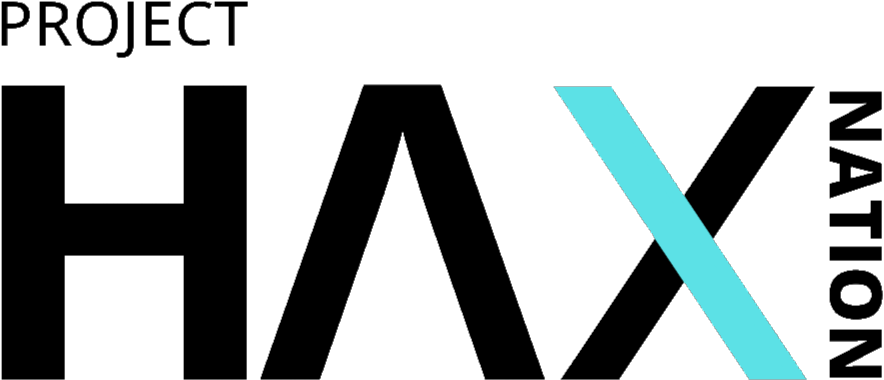

# <picture> <source srcset="assets/logo-dark.png" media="(prefers-color-scheme: dark)">  </picture>

**Project Haxnation** is an initiative by **Ayushya Shah** to create the **largest open-source repository of CTF (Capture The Flag) challenges** for security enthusiasts to explore, practice, and master various domains of cybersecurity.

---

## 💡 Motivation

Most existing CTF platforms provide either limited free content or restrict full access behind paywalls. This can hinder the learning curve, especially for beginners or students.

Additionally, challenges often lack open-source code, which limits the ability of developers to:

- Analyze how the challenge was built  
- Learn secure and insecure coding patterns  
- Modify and contribute to existing content

**Project Haxnation** is here to change that—by making high-quality, self-contained challenges freely available and open-sourced under GNU GPL v3.

---

## 🧭 Domains Covered

Project Haxnation features a growing collection of challenges across the following domains:

- 🔐 Cryptography  
- 🕵️‍♂️ Digital Forensics  
- 🌐 Networking  
- 🔍 OSINT (Open Source Intelligence)  
- 💻 Programming  
- 🔁 Reverse Engineering  
- 🌐 Web Security

---

## ⚙️ Tech Stack

There is **no single fixed tech stack**. Each challenge may use different tools or environments based on its domain.  
Some may be written in Python, C, JavaScript, Bash, etc. Others may involve packet captures, Docker, or low-level binaries.

Refer to the specific challenge's `README.md` file for setup instructions and requirements.

---

## 📦 How to Use

1. **Browse** the repository.
2. Navigate to the **folder** corresponding to the domain you're interested in.
3. Choose a **challenge**.
4. Open the `README.md` inside that challenge folder to:
   - Set up the challenge
   - Understand the rules and goals
   - Get hints (if available)
5. Launch the challenge and start solving!

---

## 🤝 Contributing

Want to contribute your own challenge or improvement? We welcome community contributions!

Checkout [CONTRIBUTING.md](https://github.com/A-Y-U-S-H-Y-A/project-haxnation/CONTRIBUTING.md) for more information.

---

## 📬 Contact

Have questions, ideas, or feedback?

📧 **ayushya.shah1201@gmail.com**

---

## 📜 License

This project is licensed under the [GNU General Public License v3](https://github.com/A-Y-U-S-H-Y-A/project-haxnation/blob/master/LICENSE).

---

⭐ If you like this project, consider giving it a **star** to support the mission!
